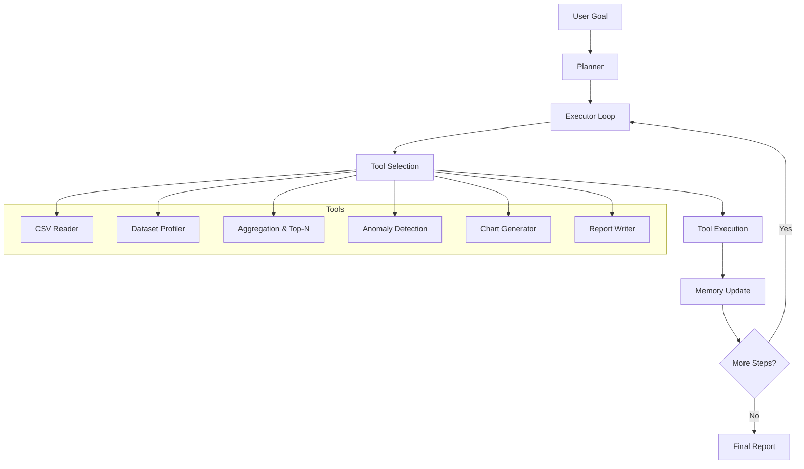

<div align="center">

# 🤖 AI Operations Agent

**An autonomous Python agent that turns high-level goals into actionable insights.**

*Give it a goal in plain English (or Spanish). It plans, executes, and delivers.*

[](https://www.python.org/)
[](https://www.langchain.com/)
[](LICENSE)
[](#-bring-your-own-key)
[](CONTRIBUTING.md)

</div>

---

## 🎯 What is this?

**AI Operations Agent** is an autonomous AI agent that receives a high-level objective, **breaks it down into steps**, **decides which tools to use**, **executes them**, and **delivers a final report** — all without human intervention.

Think of it as a junior data analyst that never sleeps:

> 💬 *"Analyze `data/sales.csv` and generate a report with actionable insights."*

…and it just does it.

---

## ✨ Why it matters

| Without an agent | With AI Operations Agent |
| --- | --- |
| 🧑‍💻 Manual exploration of data | 🤖 Automatic exploration |
| 📝 Hand-written reports | 📊 Auto-generated reports with charts |
| 🐢 Hours of repetitive analysis | ⚡ Minutes per dataset |
| 🔁 Same workflow over and over | 🧠 Adapts to each new goal |

**Use cases**: sales analysis, HR insights, support ticket triage, quick exploratory analysis on any tabular data.

---

## �️ Architecture



**Core components:**

- 🧠 **Planner** — Decomposes the goal into sub-tasks using an LLM
- ⚙️ **Executor** — Runs the plan step by step, picking the right tool each time
- 🔧 **Tools** — Modular capabilities (read CSV, analyze, generate report…)
- 💾 **Memory** — Shared state across steps so tools can build on each other
- 📜 **Logger** — Pretty, transparent logs of every decision

---

## 🚀 One-Line Install

**⚡ Install instantly without downloading files:**

| Platform | Command |
|---|---|
| 🐧 Mac/Linux | `curl -sSL https://raw.githubusercontent.com/DevNexuz/DevNexuz-AI-Operations-Agent/main/install.sh \| bash` |
| 🪟 Windows (PowerShell) | `iwr -useb https://raw.githubusercontent.com/DevNexuz/DevNexuz-AI-Operations-Agent/main/install.ps1 \| iex` |
| 🪟 Windows (CMD) | `powershell -Command "iwr -useb https://raw.githubusercontent.com/DevNexuz/DevNexuz-AI-Operations-Agent/main/install.ps1 \| iex"` |

**The script will:**
1. ✅ Verify your Python version
2. ✅ Create a virtual environment
3. ✅ Install all dependencies
4. ✅ Generate sample datasets
5. ✅ Run the demo mode to verify everything works

**⚠️ Security Note:** Always review scripts before piping from internet. View the source code first:
```bash
# Review before running
curl -sSL https://raw.githubusercontent.com/DevNexuz/DevNexuz-AI-Operations-Agent/main/install.sh
```

---

## 🧪 Script Verification

**Verify script syntax before execution:**

| Platform | Command |
|---|---|
| 🐧 Mac/Linux | `bash -n install.sh` |
| 🪟 Windows PowerShell | `PowerShell -NoProfile -Command ". .\install.ps1"` |
| 🪟 Windows Batch | `install.bat /?` |

**What this does:**
- ✅ Checks syntax without executing
- ✅ Prevents runtime errors
- ✅ Ensures script quality
- ✅ Safe verification before installation

---

## ⚡ Quickstart with Make (recommended)

If you have `make` installed, you can run any task with a single command:

```bash
make install     # Set up venv + install deps
make demo        # Run the demo (no API key needed)
make run GOAL="Analyze data/sales.csv and find top regions"
make help        # Show all available commands
```

🪟 **Windows users:** install make via Chocolatey (`choco install make`) or use WSL. Alternatively, use the install scripts (`install.bat`) or Docker.

### All available commands

**📦 Setup**
  `make install`         Create venv and install Python dependencies
  `make data`            Generate sample CSV datasets
  `make env`             Copy .env.example to .env

**🚀 Run**
  `make demo`            Run demo mode (no API key required)
  `make run`             Run agent with default goal
  `make run GOAL="..."`  Run agent with custom goal
  `make examples`        List example goals
  `make report`          Show the latest generated report

**🐳 Docker**
  `make docker-build`    Build the Docker image
  `make docker-demo`     Run demo inside Docker
  `make docker-run`      Run agent inside Docker
  `make docker-shell`    Open shell inside the container
  `make ollama-up`       Start local Ollama service
  `make ollama-pull MODEL=llama3.1`   Pull a model into Ollama
  `make ollama-down`     Stop local Ollama service

**🧹 Clean**
  `make clean`           Remove caches and outputs
  `make clean-venv`      Remove the virtual environment
  `make clean-docker`    Remove Docker artifacts
  `make clean-all`       Nuke everything

**🔍 Misc**
  `make verify`          Verify imports and project layout
  `make tree`            Show project structure
  `make stats`           Show project stats (LOC, files)

### Step-by-step usage

#### Paso 4.1 — Verify you have `make`
```bash
make --version
```
**Expected:** something like GNU Make 4.x. If you don't have it, see Windows options above.

#### Paso 4.2 — View the help menu
```bash
make
```
This shows all available commands, grouped and with colors. UX test: does it look good? If yes, you're on track.

#### Paso 4.3 — Complete setup in 3 commands
```bash
make install      # Creates venv + installs deps
make data         # Generates example CSVs
make demo         # Verifies everything works
```

#### Paso 4.4 — Test with a real goal
```bash
make env                                                    # Copies .env.example to .env
# Edit .env and paste your API key
make run GOAL="Analyze data/sales.csv and find anomalies"
```

#### Paso 4.5 — View the generated report
```bash
make report
```

#### Paso 4.6 — Docker mode
```bash
make docker-build
make docker-demo
make docker-run GOAL="Analyze data/employees.csv"
```

#### Paso 4.7 — Verify the project
```bash
make verify    # Checks all imports work
make stats     # Tells you lines of code
make tree      # Shows structure
```

#### Paso 4.8 — Clean up when done
```bash
make clean         # Only caches and outputs
make clean-all     # Everything: venv, caches, docker
```

---

## 🚀 Quickstart (Enterprise Installation)

### 🎯 Option 1: Automated Installation (Recommended)

**Multi-platform enterprise installation with conda integration:**

```bash
# Linux/macOS
./install.sh

# Windows PowerShell
./install.ps1

# Windows Batch
install.bat
```

**Features:**
- ✅ Automatic conda environment setup
- ✅ System requirements validation  
- ✅ Interactive LLM provider configuration
- ✅ Performance benchmarking
- ✅ Sample data generation
- ✅ Production demo (no API key required)

---

### 🏗️ Option 2: Project Scaffolding

**Create project structure from scratch:**

```bash
# Windows
setup_project.bat

# Then follow with installation:
cd ai-operations-agent
install.bat
```

---

### 📦 Option 3: Manual Installation

**Clone & install manually:**

```bash
git clone https://github.com/DevNexuz/DevNexuz-AI-Operations-Agent.git
cd DevNexuz-AI-Operations-Agent
pip install -r requirements.txt
```

### 4. Configure your LLM provider

```bash
cp .env.example .env
```

Open `.env` and pick **one** provider (see [BYOK](#-bring-your-own-key) below).

### 5. Run it

```bash
python main.py "Analiza data/ventas.csv y genera insights accionables"
```

That's it. The agent will plan, execute, and drop a report in `outputs/`.

---

## 🔑 Bring Your Own Key

This project is **100% BYOK** — you bring your own API key, we don't host anything. Pick whichever provider works for you:

| Provider | Cost | Speed | Setup |
| --- | --- | --- | --- |
| 🟢 **Groq** | **Free tier** ✨ | ⚡⚡⚡ Very fast | [Get key](https://console.groq.com/) |
| 🦙 **Ollama** | **Free (local)** ✨ | 🐢 Depends on your machine | [Install](https://ollama.com/) |
| 🤖 **OpenAI** | 💰 Pay per token | ⚡⚡ Fast | [Get key](https://platform.openai.com/) |
| 🧠 **Anthropic** | 💰 Pay per token | ⚡⚡ Fast | [Get key](https://console.anthropic.com/) |
| 🤖 **xAI (Grok)** | **Free tier** ✨ | ⚡⚡ Fast | [Get key](https://console.x.ai/) |
| 💎 **Google Gemini** | **Free tier** ✨ | ⚡⚡ Fast | [Get key](https://aistudio.google.com/apikey) |

> 💡 **No credit card?** Use **Groq**, **Gemini**, or **xAI** (free tiers) — or **Ollama** (local, fully free).

---

## 🧪 Verifying your install

After cloning, run the demo to confirm everything works **without needing an API key**:

```bash
pip install -r requirements.txt
python main.py --demo
```

You should see:

- 🎯 The agent's goal printed in a banner
- 📋 A 7-step plan rendered in a table
- ⚙️ Each step executing with colored status
- ✅ A final summary panel
- 📄 A real Markdown report at `outputs/report.md`
- 📊 A chart at `outputs/charts/revenue_by_region.png`

If that works, you're ready to use a real LLM:

```bash
cp .env.example .env
# Edit .env: pick a provider and paste your key
python main.py --goal "Analyze data/sales.csv and find the top regions"
```

---

## � Docker (recommended for portability)

Run the agent **without installing Python or any dependencies** on your machine. You only need [Docker](https://docs.docker.com/get-docker/) installed.

### Quickstart with Docker

```bash
# Build the image (one-time, ~2 minutes)
docker compose build

# Try the demo (no API key needed)
docker compose run --rm agent --demo

# Run with your own goal (requires .env with an API key)
docker compose run --rm agent --goal "Analyze data/sales.csv and find top regions"
```

### Convenience Scripts (Recommended)

| Platform | Command |
|---|---|
| 🐧 Mac/Linux | `./docker-run.sh demo` |
| 🪟 Windows | `docker-run.bat demo` |

Run with help to see all commands:
```bash
./docker-run.sh help
```

### 🦙 Fully Offline Mode (Docker + Ollama)

Want to run everything locally — no cloud API, no API key, no internet after setup? Use the Ollama profile:

```bash
# 1. Start Ollama
./docker-run.sh ollama-up

# 2. Pull a model (one-time, ~4 GB)
./docker-run.sh ollama-pull llama3.1

# 3. Configure the agent to use Ollama
echo "LLM_PROVIDER=ollama" > .env

# 4. Run!
./docker-run.sh goal "Analyze data/sales.csv"
```

### Step-by-Step Guide

#### Paso 6.1 — Verify Docker Installation
```bash
docker --version
docker compose version
```

#### Paso 6.2 — Build the Image
```bash
docker compose build
```

#### Paso 6.3 — Test Demo Mode
```bash
docker compose run --rm agent --demo
```

#### Paso 6.4 — Test with Real LLM
```bash
cp .env.example .env
# Edit .env with your API key
docker compose run --rm agent --goal "Analyze data/sales.csv and find top regions"
```

#### Paso 6.5 — Verify Outputs
```bash
ls outputs/
cat outputs/report.md
```

#### Paso 6.6 — Offline Mode with Ollama (Optional)
```bash
./docker-run.sh ollama-up
./docker-run.sh ollama-pull llama3.1
echo "LLM_PROVIDER=ollama" >> .env
./docker-run.sh goal "Analyze data/sales.csv"
```

### 🧪 Verification and Troubleshooting

#### Verify Image Size
```bash
docker images ai-operations-agent
```
**Expected:** ~500-650 MB. If you see >1GB, something went wrong with the build context.

#### View Logs if Something Fails
```bash
docker compose logs agent
```

#### Enter Container for Debugging
```bash
docker compose run --rm --entrypoint /bin/bash agent
```
Once inside, you can:
```bash
ls /app
python -c "from agent import get_llm; print('OK')"
exit
```

#### ⚠️ Common Troubleshooting

**❌ "permission denied" writing to outputs/**
- **Cause:** Container runs as UID 1000 but your host user has different UID
- **Solution (Linux):**
  ```bash
  sudo chown -R 1000:1000 outputs/ data/
  ```
- **Alternative:** Edit Dockerfile and change UID to match your user:
  ```bash
  id -u   # Shows your UID, e.g. 1001
  # In Dockerfile, change --uid 1000 to your actual UID
  ```

**❌ Ollama not responding from agent**
- **Cause:** Agent tries to connect to localhost:11434 but inside container localhost is the container itself
- **Solution:** Already resolved in docker-compose.yml with `OLLAMA_BASE_URL=http://ollama:11434`. Just make sure to start Ollama with the profile.

**❌ "no space left on device" during build**
- **Solution:**
  ```bash
  docker system prune -a
  ```

**❌ Very slow build**
- **Cause:** Something large is in the build context
- **Check:**
  ```bash
  du -sh .
  # If you see >100MB without venv/, something is wrong with .dockerignore
  ```

**❌ Demo runs but files don't appear on PC (Windows)**
- **Cause:** WSL2 + paths with spaces or accented characters
- **Solution:** Move to a path like `C:\dev\ai-operations-agent` (no spaces or accents)

### Cleanup
```bash
./docker-run.sh clean   # Removes containers, image, and volumes
```

---

## �� Example goals

Drop these into `--goal`:

```bash
python main.py "Analiza data/ventas.csv y encuentra los productos más vendidos por región"
python main.py "Revisa data/empleados.csv e identifica patrones de rotación"
python main.py "Analiza data/tickets.csv y sugiere mejoras para el tiempo de respuesta"
```

More examples in [`examples/example_goals.md`](examples/example_goals.md).

---

## 📁 Project structure

```text
ai-operations-agent/
├── agent/              # Planner, Executor, Memory, LLM factory
├── tools/              # CSV reader, analyzer, report writer
├── prompts/            # Prompt templates (real prompt engineering)
├── data/               # Sample datasets
├── outputs/            # Generated reports land here
├── examples/           # Predefined goals to try
├── main.py             # CLI entry point
└── .env.example        # Multi-provider config template
```

---

## 🧩 Extending it

Want to add a new tool? It's 3 steps:

1. Create a function in `tools/` decorated with `@tool` (LangChain).
2. Register it in `agent/executor.py`.
3. The planner picks it up automatically.

See [CONTRIBUTING.md](CONTRIBUTING.md) for details.

---

## ⚠️ Known Limitations

These are conscious design tradeoffs, not oversights. Understanding them helps you decide when this agent fits your use case — and when it doesn't.

| Limitation | Why it exists | Workaround |
|---|---|---|
| **One tool call per step** | Keeps the executor simple, auditable, and provider-agnostic. Parallel tool execution would require async coordination and complicates error recovery. | Break complex goals into explicit sub-goals. |
| **Local CSV files only** | Scope is intentionally narrow — data connectors (SQL, APIs, S3) are each a project on their own. | Pre-export your data to CSV before running. |
| **No memory between sessions** | Each run starts fresh. There is no persistent vector store or session history. The `outputs/agent_memory.json` log is human-readable but not loaded on the next run. | Chain runs manually by referencing previous outputs in your goal. |
| **LLM tool-calling required** | The executor relies on native tool-calling (function calling) from the LLM. Models that don't support it — or support it inconsistently — will fail silently or produce empty steps. | Use a tested provider: Groq, OpenAI, Anthropic, or Ollama with `qwen2.5`, `llama3.1`, or `phi4`. |
| **Small local models (~7B) may mis-plan** | Structured output with a strict Pydantic schema is demanding. Models below ~13B parameters occasionally produce malformed JSON or skip required fields. | Use Groq (free, fast) for reliable results. For Ollama, prefer 13B+ models. |
| **No sandboxed code execution** | There is no `python_exec` tool in the current build. Executing LLM-generated code safely requires Docker isolation or `RestrictedPython` — out of scope for v1. | Use the built-in analysis tools. A sandboxed executor is planned. |

---

## 🗺️ Roadmap

- [ ] Sandboxed `python_exec` tool (Docker-isolated)
- [ ] `summarize_data` tool with business / quality / statistical modes
- [ ] Web UI with Streamlit
- [ ] Support for Excel/Parquet files
- [ ] PDF report export
- [ ] Multi-agent mode (CrewAI)
- [ ] Vector memory for long sessions

---

## 📜 License

MIT — see [LICENSE](LICENSE). Use it freely, including for commercial projects.

---

## 👤 Author

Built by **DevNexuz** — Python developer focused on AI agents and automation.

- 🐙 GitHub: [@DevNexuz](https://github.com/DevNexuz)

⭐ **If this project helped you, consider giving it a star!**

## 📁 Project Structure

```text
ai-ops-agent/
├── README.md              ⭐ Hero section + GIF + quickstart
├── LICENSE                (MIT)
├── CONTRIBUTING.md        (mínimo, ~20 líneas)
├── .env.example           ⭐ con TODOS los providers documentados
├── main.py                ⭐ CLI con argparse limpio
├── requirements.txt
├── agent/
│   ├── planner.py
│   ├── executor.py
│   ├── memory.py
│   └── llm_factory.py     ⭐ Abstrae OpenAI/Anthropic/Groq/Ollama/xAI/Gemini
├── tools/
│   ├── csv_tools.py
│   ├── analysis_tools.py
│   └── report_tools.py
├── prompts/
│   └── prompts.py
├── data/
│   ├── ventas.csv
│   ├── empleados.csv
│   └── tickets.csv
├── outputs/               (.gitkeep)
├── examples/
│   └── example_goals.md   ⭐ Goals predefinidos
└── .github/
    └── ISSUE_TEMPLATE/
        ├── bug_report.md
        └── feature_request.md
```

## 🚀 Features

- **🧠 Smart Planning**: Decomposes complex goals into executable steps
- **🔧 Tool Selection**: Automatically chooses the right tool for each task
- **💾 Memory System**: Maintains context between steps
- **📊 Rich Output**: Beautiful reports with charts and visualizations
- **🔄 Error Handling**: Automatic retry and fallback mechanisms
- **📝 Transparent Logs**: See the agent "thinking" in real-time
- **🌐 Multi-Provider**: Support for OpenAI, Anthropic, Groq, Ollama, xAI (Grok), and Google Gemini

## 📊 Without Agent vs With Agent

| Aspect | Without Agent | With AI Operations Agent |
| -------- | --------------- | --------------------------- |
| Time to Insights | Hours of manual work | Minutes |
| Consistency | Variable | Standardized |
| Reproducibility | Hard to replicate | Automatic logging |
| Learning Curve | Steep | Natural language |
| Error Handling | Manual debugging | Automatic recovery |

## 🎯 Example Goals

```bash
# Sales analysis
python main.py "Analiza data/ventas.csv y encuentra los productos más vendidos por región"

# HR insights
python main.py "Revisa data/empleados.csv e identifica patrones de rotación"

# Support optimization
python main.py "Analiza data/tickets.csv y sugiere mejoras para el tiempo de respuesta"
```

## 🔧 Configuration

Supported AI providers:

```bash
# OpenAI (default)
OPENAI_API_KEY=your_key_here

# Anthropic Claude
ANTHROPIC_API_KEY=your_key_here

# Groq
GROQ_API_KEY=your_key_here

# Ollama (local)
OLLAMA_BASE_URL=http://localhost:11434
```

## 🛠️ Extending the Agent

Adding new tools is simple:

```python
# tools/my_tool.py
from agent.tools import Tool

class MyCustomTool(Tool):
    name = "my_tool"
    description = "Does something amazing"
    
    def execute(self, input_data):
        # Your tool logic here
        return result
```

## 🔧 Windows Troubleshooting

### Encoding Issues
If Notepad saves with strange encoding (UTF-16 LE BOM), errors may occur:

```cmd
✅ Solution: Use VS Code or Notepad++ and save as UTF-8
✅ In Notepad: File → Save As → Encoding: ANSI or UTF-8
❌ Avoid: UTF-16 LE BOM encoding
```

### Paths with Spaces
.bat files may fail in paths with spaces or accents:

```cmd
✅ Recommended: C:\Users\Your\Projects\ai-operations-agent
❌ Avoid: C:\Mis Documentos\Proyectos AI\ai-operations-agent
```

### Debug Mode
To see errors when double-clicking (window closes on error):

```cmd
# Keep window open after completion
cmd /k install.bat

# Or run from CMD directly
install.bat
```

### Antivirus Interference
Some antivirus software blocks .bat files:

```cmd
✅ Solution 1: Add project folder to antivirus exceptions
✅ Solution 2: Run as Administrator (if trusted)
❌ Avoid: Disabling antivirus completely
```

### Performance Issues
If installation is slow on Windows:

```cmd
✅ Check: Windows Defender real-time protection
✅ Solution: Add project folder to exclusions
✅ Alternative: Use PowerShell script instead
```

---

## 🎥 Recording your own demo GIF

For your portfolio or documentation:

1. Use [asciinema](https://asciinema.org/) or [terminalizer](https://terminalizer.com/) to record.
2. Run `python main.py --demo` (deterministic, perfect for recording).
3. Convert to GIF and save as `demo.gif` in the repo root.
4. The README's hero image will pick it up automatically.

## 📈 Demo Output

The agent generates comprehensive reports including:

- 📊 **Executive Summary** - Key findings at a glance
- 📈 **Visualizations** - Charts and graphs automatically generated
- 📋 **Detailed Analysis** - Step-by-step reasoning
- 💡 **Actionable Insights** - Recommendations based on data

## 🤝 Contributing

Contributions are welcome! Please read our [Contributing Guide](CONTRIBUTING.md).

## 📄 License

This project is licensed under the MIT License - see the [LICENSE](LICENSE) file for details.

## 🙏 Acknowledgments

- Built with [LangChain](https://python.langchain.com/)
- Powered by [OpenAI](https://openai.com/)
- Styled with [Rich](https://rich.readthedocs.io/)

---

**Made with ❤️ by DevNexuz**
